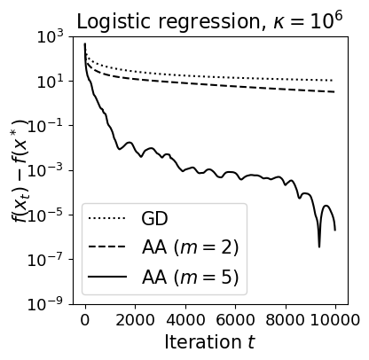

# Anderson Acceleration for Fixed-Point Iteration
Implementation of the (regularized) Anderson acceleration (aka Approximate Maximum Polynomial Extrapolation -- AMPE). This repository accompanies the following paper:

> T. D. Nguyen, A. R. Balef, C. T. Dinh, N. H. Tran, D. T. Ngo, T. A. Le, and P. L. Vo. "Accelerating federated edge learning," in IEEE Communications Letters, 25(10):3282–3286, 2021.

**Check out my blog post [here](https://joshnguyen.net/posts/anderson-acceleration) for an introduction.**

You can find the implementation in the [aa.py](https://github.com/joshnguyen99/anderson_acceleration/blob/main/aa.py) file. The `AndersonAcceleration` class should be in instantiated with the `window_size` ($m_t$, defaulted to $5$) and `reg` ($\lambda$, defaulted to $0$). Here's an example.

```python
>>> import numpy as np
>>> from aa import AndersonAcceleration
>>> acc = AndersonAcceleration(window_size=2, reg=0)
>>> x = np.random.rand(100)  # some iterate
>>> x_acc = acc.apply(x)     # accelerated from x
```

You will need to apply $g$ to $x_t$ first. The result $g(x_t)$ should be the input to `acc.apply`, which will solve for $\alpha^{(t)}$ and extrapolate to find $x_{t+1}$ (see the [blog post](https://joshnguyen.net/posts/anderson-acceleration) or paper for more information).

## Some numerical examples
### Minimizing a convex quadratic objective

We will minimize a strictly convex quadratic objective. Check [`quadratic_example.ipynb`](https://github.com/joshnguyen99/anderson_acceleration/blob/main/quadratic_example.ipynb) for more detail. The below plot shows the _optimality gap_ between $f(x_t)$ and $f(x^\ast)$ over $t$. AA with a window size of 2 converges much faster than the vanilla gradient descent (GD).

<p align="center">
    
</p>

### Minimizing a convex non-quadratic objective

We will minimize the $\ell_2$-regularized cross entropy loss function for logistic regression. Check [`logistic_regression_example.ipynb`](logistic_regression_example.ipynb) for more detail. Similarly, AA is much more favorable than the vanilla GD when optimizing this objective.

<p align="center">
    
</p>

TODO:
- [ ] Add a version for `torch`'s model parameters