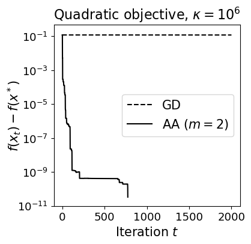

# Anderson Acceleration for Fixed-Point Iteration
Implementation of the (regularized) Anderson acceleration (aka Approximate Maximum Polynomial Extrapolation -- AMPE).

```python
>>> import numpy as np
>>> from aa import AndersonAccelerationModule
>>> acc = AndersonAccelerationModule(window_size=5, reg=1e-8)
>>> x = np.random.rand(100)  # some iterate
>>> x_acc = acc.apply(x)     # accelerated from x
```

Check the jupyter notebook for examples.

